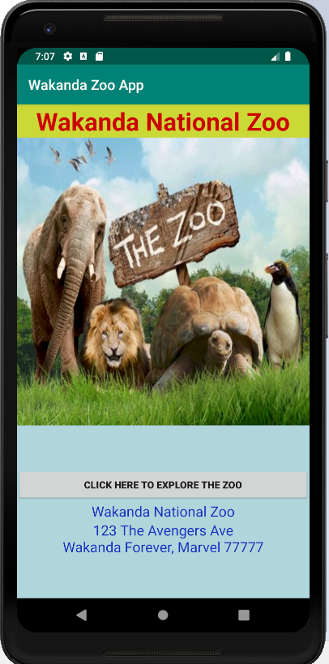
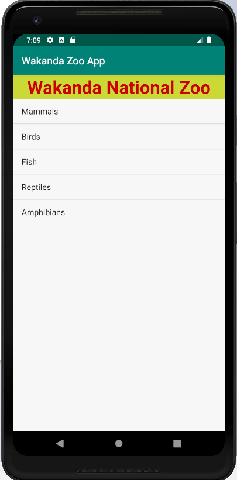
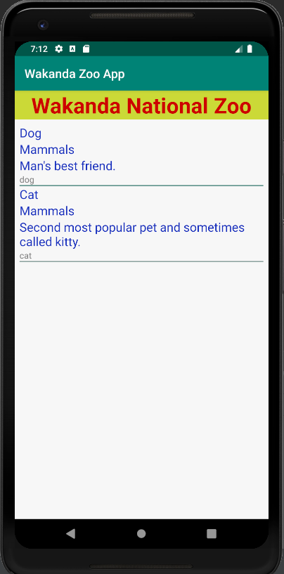
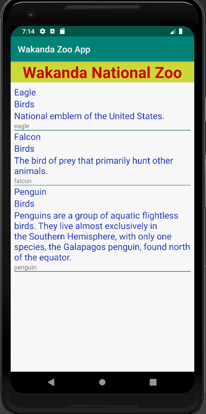
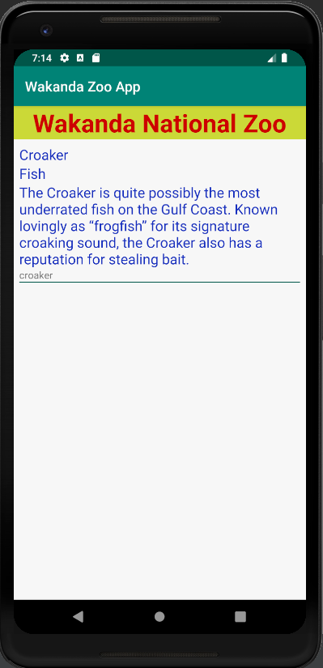
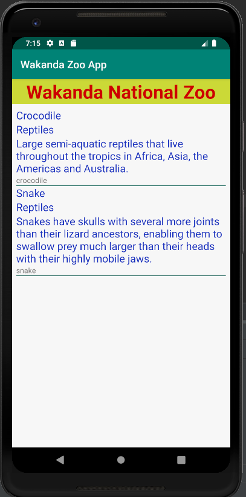
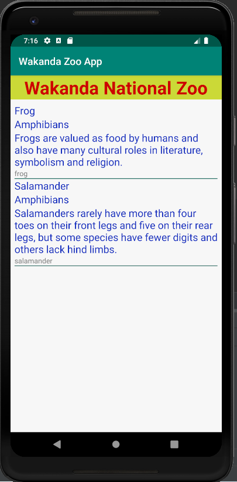
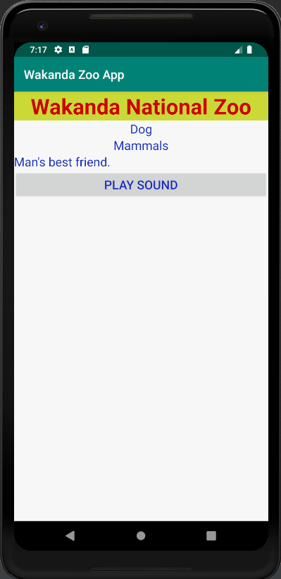
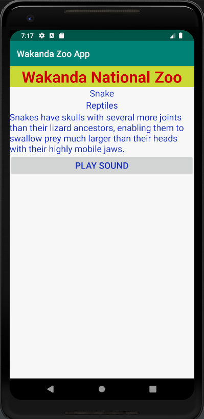

# Week2Daily3ZooApp
Wakanda National Zoo - Recycler and List Views

Homework Week Two Day Three

Research word file: Week2Day3Research.docx

Coding Project: Wakanda National Zoo App

Coding
Create an app which is a directory for all the animals in a zoo.
1. Activity one: Make a homepage for zoo information
2. Activity two: ListView with list of all the categories.
3. Activity three: RecyclerView with a list of all the animals in that category
4. Activity four: Detail of that animal selected from the list. It should have the detail of that animal and play a sound of that animal.

*You should just need a basic list view.  I will include link below.
DUE DATE June 27, 2019 at 8:59am ET

Instructions:

- Run the Android project
- Create a new Virtual Device if not already. Then, choose Pixel 2 XL, then click OK.
- Click on the "Click Here to Explore the Zoo" button.
- It will then display the categories of animal using the ListView.
- When you click on each of the category, it will then display the list of animals in that category using the RecyclerView.
- In the next activity, click on each of the animal item itself, it will then bring up the animal page.
- In each animal page, click on the "Play Sound" button to listen to the animal's sound.

